# ToolForge — Database Architecture

> **Mission 1 — Enterprise Backend Architecture · Design document (no implementation).**
> Target stack: **PostgreSQL (Supabase) · Prisma ORM · Next.js 16 · TypeScript**.
> The frontend is frozen. This schema is derived from the existing frozen data
> contracts in `lib/invoice-types.ts`, `lib/dashboard-data.ts`, `lib/site-data.ts`,
> `lib/invoice-templates.ts`, and the 57 mapped routes. Nothing here changes the UI.

---

## 1. Design goals

ToolForge is not "an invoice app." It is a **multi-tenant platform that hosts a
catalogue of 40+ tools today and must reach 100+ without a backend redesign**. The
data model is therefore built around three load-bearing ideas:

| # | Principle | Consequence in the schema |
|---|-----------|---------------------------|
| 1 | **Workspace is the tenant boundary.** | Every business row carries `workspaceId`. All queries are workspace-scoped by default. |
| 2 | **Tools are data, not code branches.** | A `Tool` registry row + a polymorphic `Document` model let new tools ship with **zero migrations**. |
| 3 | **History is append-only.** | `AuditLog` and `ActivityEvent` are never mutated; totals are snapshotted onto documents so financial history is immutable. |

Supporting principles:

- **One source of truth per fact.** Financial totals are computed by the service
  layer and *snapshotted* onto the `Document` (matching the frozen `InvoiceData`
  shape which already carries `subtotal`/`total`), so a document reads identically
  years later even if tax rules change.
- **Soft-delete by default** for tenant data (`deletedAt`), hard-delete only for
  ephemeral tokens.
- **UUID/CUID primary keys** (never sequential integers) so IDs are safe to expose
  in URLs like `/dashboard/invoices/[id]`.
- **`workspaceId` is the first column of almost every composite index** — tenancy
  and performance are the same decision.

---

## 2. Tenancy model

```
User ──< Membership >── Workspace ──< Document / Client / Product / ToolRun / ...
                            │
                            └── Subscription (plan + entitlements)
```

- A **User** is a global identity (one human, one login).
- A **Workspace** is a tenant — the frozen UI proves this: the `WorkspaceSwitcher`
  lists *"Acme Corporation", "Personal", "Freelance"* and a **"+ Create workspace"**
  action. A user belongs to many workspaces; a workspace has many users.
- **Membership** is the join table and the seat of **RBAC** (`role` lives here, not
  on `User`) — see `RBAC.md`. This is why the same person can be `OWNER` of
  "Personal" and `MEMBER` of "Acme Corporation".
- **All domain data hangs off `Workspace`**, never directly off `User`. Deleting a
  user does not delete a workspace's invoices; removing a member revokes access
  without data loss.

**Isolation strategy:** application-enforced tenant scoping in the repository layer
(every query injects `where: { workspaceId }`) as the primary control, with the
option to add **Postgres Row-Level Security** as defence-in-depth (see §13). This is
the coherent choice given Prisma owns the schema and Auth.js owns identity (see
`AUTH_FLOW.md` for why not Supabase Auth/RLS as the primary mechanism).

---

## 3. Entity groups (the map)

The ~30 models fall into seven bounded groups. Each group is owned by one service
(see `API_ARCHITECTURE.md`).

| Group | Models | Purpose |
|-------|--------|---------|
| **Identity & Access** | `User`, `Account`, `Session`, `VerificationToken`, `TwoFactorSecret`, `BackupCode` | Auth.js core + 2FA. |
| **Tenancy & Billing** | `Workspace`, `WorkspaceSettings`, `Membership`, `Invitation`, `Plan`, `Subscription` | Tenants, seats, roles, plan entitlements. |
| **Tool Registry** | `ToolCategory`, `Tool`, `WorkspaceToolPin`, `ToolRun` | The plug-in surface for 100+ tools. |
| **Documents (polymorphic core)** | `Document`, `DocumentItem`, `DocumentSequence`, `DocumentShare` | Invoices, quotes, receipts, salary slips, POs, credit notes — one table. |
| **Business records** | `Client`, `Product`, `TemplateAsset` | Reusable CRM + catalogue data behind documents. |
| **Money movement** | `Payment`, `PaymentAllocation` | Recording/collecting payment against documents. |
| **Comms & Observability** | `FileObject`, `EmailMessage`, `Notification`, `AuditLog`, `ActivityEvent` | Files, transactional email, in-app notifications, immutable history. |

---

## 4. The polymorphic Document core (the key decision)

The mission requires that **Invoice Generator, Quotation Generator, Receipt
Generator, Salary Slip, Purchase Order, Credit Note** and more can be added without
redesigning the backend. Every one of those is *"a numbered, dated, itemized,
branded document with parties, totals, a status lifecycle, and a PDF."* So they are
**one model**, discriminated by `DocumentType`, not one table each.

```
Document
├── type            DocumentType   (INVOICE | QUOTE | RECEIPT | SALARY_SLIP | PURCHASE_ORDER | CREDIT_NOTE | ...)
├── workspaceId     (tenant)
├── toolId          → Tool         (which registry tool produced it)
├── number          "INV-2024-001" (from DocumentSequence)
├── status          DocumentStatus (DRAFT | SENT | PAID | OVERDUE | ACCEPTED | VOID ...)
├── issueDate / dueDate
├── currency
├── issuer  (JSON snapshot of BusinessDetails)   ← frozen shape
├── recipient (JSON snapshot of ClientDetails)   ← frozen shape, optional clientId link
├── items   → DocumentItem[]
├── taxConfig / discount / shipping (JSON)        ← frozen TaxConfig etc.
├── subtotal / taxTotal / total  (snapshotted numeric)
├── branding (JSON: brandColor, logoFileId, showLogo…)  ← frozen brandingSection
├── notes / terms / paymentInstructions / bankDetails (JSON)
├── payload   Json?   ← TYPE-SPECIFIC fields live here (see below)
├── templateId → TemplateAsset
├── pdfFileId  → FileObject
└── audit: createdBy, createdAt, updatedAt, deletedAt
```

### Why the `payload` JSONB column matters

Shared fields are real columns (indexed, queryable, reportable). **Type-specific
fields go in `payload` (JSONB), validated by a per-tool Zod schema** (see
`API_ARCHITECTURE.md §Validation`). Examples:

| Document type | Shared columns used | `payload` (JSONB) holds |
|---------------|--------------------|--------------------------|
| **Invoice** | all financial columns | `poReference`, `recurringRuleId` |
| **Quotation** | all financial columns | `validUntil`, `acceptedAt`, `convertedInvoiceId` |
| **Receipt** | total, issuer, recipient | `paymentMethod`, `amountTendered`, `sourceInvoiceId` |
| **Salary Slip** | issuer, recipient, total | `payPeriod`, `earnings[]`, `deductions[]`, `netPay`, `employeeId` |
| **Purchase Order** | items, total, issuer | `supplier`, `deliveryDate`, `shippingTerms` |
| **Credit Note** | total, tax | `sourceInvoiceId`, `reason` (already in the frozen tool catalogue) |

**Adding "Delivery Note" tool = insert one `Tool` row + one Zod payload schema +
one PDF template. Zero schema migration.** That is the design contract the mission
demands.

`DocumentItem` (the line-item table) is shared by all document types and mirrors the
frozen `InvoiceItem` (`description`, `quantity`, `rate`, `unit`) plus `amount`
(snapshot), `taxRate`, and `position` (for the frozen drag-to-reorder feature).

---

## 5. Tool Registry — the "100+ tools" engine

The frozen `lib/site-data.ts` already defines the catalogue shape (`slug`, `name`,
`category`, `status: 'popular'|'new'|'pro'`, `features[]`, `steps[]`). We promote it
from a static array to a table so tools become **operational data**.

```
ToolCategory (billing-invoicing | documents-contracts | finance-tax | productivity)
   └──< Tool
          ├── slug            'invoice-generator'   (matches /tools/[slug])
          ├── name / tagline / description
          ├── categoryId
          ├── kind            ToolKind  (DOCUMENT | CALCULATOR | UTILITY | GENERATOR)
          ├── outputType      DocumentType?  (for DOCUMENT tools)
          ├── status          ToolStatus (POPULAR | NEW | PRO)
          ├── minPlan         PlanTier  (FREE | PRO | BUSINESS)  ← gates 'pro' tools
          ├── isActive / featured / addedAt / sortWeight
          └── schemaKey       'invoice.v1'  ← names the Zod payload validator
```

Two `ToolKind`s cover everything in the mission list:

- **DOCUMENT / GENERATOR tools** → persist a `Document` (Invoice, Quotation,
  Receipt, Salary Slip, PO, Credit Note, QR Generator, Barcode Generator produce a
  stored artifact).
- **CALCULATOR / UTILITY tools** → mostly stateless compute (GST Calculator, EMI
  Calculator, Loan Calculator, Number To Words, Unit Converter, Profit Margin).
  These optionally persist a lightweight **`ToolRun`** (input JSON + output JSON +
  optional `resultFileId`) so users can revisit saved calculations and so usage
  analytics ("uses: 2.4M" in the catalogue) become real counts.

`WorkspaceToolPin` records which tools a workspace has pinned/favourited (drives a
"your tools" surface without touching global catalogue rows).

`minPlan` on `Tool` + `Subscription.planTier` on the workspace is exactly how the
frozen pricing table gates *"All 40+ tools"* to Pro/Business — this is **entitlement
gating**, orthogonal to RBAC (see `RBAC.md §Two axes`).

---

## 6. ER diagram

```mermaid
erDiagram
    USER ||--o{ ACCOUNT : "oauth"
    USER ||--o{ SESSION : "has"
    USER ||--o| TWOFACTORSECRET : "may enable"
    USER ||--o{ MEMBERSHIP : "joins via"
    WORKSPACE ||--o{ MEMBERSHIP : "grants seats"
    WORKSPACE ||--|| WORKSPACESETTINGS : "configured by"
    WORKSPACE ||--o{ INVITATION : "invites"
    WORKSPACE ||--|| SUBSCRIPTION : "billed by"
    PLAN ||--o{ SUBSCRIPTION : "priced as"

    WORKSPACE ||--o{ DOCUMENT : "owns"
    WORKSPACE ||--o{ CLIENT : "owns"
    WORKSPACE ||--o{ PRODUCT : "owns"
    WORKSPACE ||--o{ TOOLRUN : "runs"
    WORKSPACE ||--o{ DOCUMENTSEQUENCE : "numbers via"
    WORKSPACE ||--o{ FILEOBJECT : "stores"
    WORKSPACE ||--o{ NOTIFICATION : "receives"
    WORKSPACE ||--o{ AUDITLOG : "records"
    WORKSPACE ||--o{ ACTIVITYEVENT : "streams"

    TOOLCATEGORY ||--o{ TOOL : "groups"
    TOOL ||--o{ DOCUMENT : "produces"
    TOOL ||--o{ TOOLRUN : "produces"
    TOOL ||--o{ WORKSPACETOOLPIN : "pinned by"

    DOCUMENT ||--o{ DOCUMENTITEM : "contains"
    DOCUMENT }o--o| CLIENT : "billed to"
    DOCUMENT }o--o| TEMPLATEASSET : "styled by"
    DOCUMENT }o--o| FILEOBJECT : "exported as"
    DOCUMENT ||--o{ PAYMENT : "settled by"
    DOCUMENT ||--o{ DOCUMENTSHARE : "shared via"
    PAYMENT ||--o{ PAYMENTALLOCATION : "splits into"
    DOCUMENT ||--o{ PAYMENTALLOCATION : "receives"

    CLIENT ||--o{ DOCUMENT : "receives"
    PRODUCT ||--o{ DOCUMENTITEM : "referenced by"

    USER ||--o{ DOCUMENT : "created"
    USER ||--o{ AUDITLOG : "acted"
    WORKSPACE ||--o{ EMAILMESSAGE : "sends"
    DOCUMENT ||--o{ EMAILMESSAGE : "delivered by"
```



---

## 7. Relationship catalogue

| From | To | Cardinality | Rule / on-delete |
|------|----|-------------|-------------------|
| User ↔ Workspace | via Membership | M:N | Remove member → delete Membership only. |
| Workspace → WorkspaceSettings | 1:1 | Cascade delete. Holds onboarding output (currency, tax region, brand). |
| Workspace → Subscription | 1:1 | Cascade. `planTier` drives entitlements. |
| Workspace → Document | 1:M | Soft-delete document; restrict hard-delete of workspace with documents. |
| Tool → Document | 1:M | `Restrict` — cannot delete a Tool that produced documents (deactivate instead). |
| Document → DocumentItem | 1:M | Cascade. Items are owned by the document. |
| Document → Client | M:1 (optional) | `SetNull` — deleting a client keeps the invoice (recipient is snapshotted on the doc). |
| Document → Payment | 1:M | Cascade. |
| Payment → PaymentAllocation → Document | M:N through allocations | One payment can settle multiple invoices (over-payment / batch). |
| Quotation → Invoice | 1:1 (optional, via `payload.convertedInvoiceId`) | The frozen "convert quote to invoice" flow. |
| Document → FileObject (pdf) | M:1 (optional) | `SetNull`. Regenerating the PDF replaces the file. |
| Workspace → DocumentSequence | 1:M | One sequence per (workspace, documentType, year) → thread-safe numbering. |
| User → AuditLog (actor) | 1:M | `SetNull` on user delete (keep the audit trail, lose the FK). |

**Snapshot-over-reference rule:** `Document.issuer` and `Document.recipient` are
JSON snapshots even when a `clientId` FK exists. A sent invoice must never change
because someone later edited the client's address. This mirrors the frozen
`InvoiceData` which embeds full `business` and `client` objects.

---

## 8. Invoice Engine — data architecture

The invoice engine is the flagship `DocumentType.INVOICE`. Its data concerns:

### 8.1 Numbering (`DocumentSequence`)
The frozen data shows `"INV-2024-001"`. Sequential, gap-free, per-tenant numbering
is a classic race condition, so it gets its own table:

```
DocumentSequence  @@unique([workspaceId, documentType, period])
├── prefix      "INV"
├── period      "2024"          (yearly reset; configurable)
├── nextValue   Int             (incremented atomically inside the create transaction)
└── padding     3               → "001"
```
Allocation happens inside the same DB transaction that inserts the `Document`, using
a row-level lock (`SELECT … FOR UPDATE` semantics), guaranteeing no duplicate numbers
even under concurrent creation. Format string lives in `WorkspaceSettings`.

### 8.2 Totals (snapshot, computed server-side)
The frozen `calculateInvoiceTotals()` logic (subtotal → discount → shipping → tax
inclusive/exclusive) is **re-implemented in the service layer as the single source
of truth** and the results are written to `subtotal / taxTotal / total`. The client
preview may compute for display, but **the server recomputes and persists** — the UI
never dictates money. `discount`, `shipping`, `taxConfig` are stored as JSON exactly
matching the frozen `TaxConfig`/discount/shipping shapes so no UI change is needed.

### 8.3 Status lifecycle
```
DRAFT ──send──▶ SENT ──(due date passes, unpaid)──▶ OVERDUE
  │                │                                   │
  │                └──────── record payment ───────────┴──▶ PAID
  └──▶ VOID (cancelled)
```
Statuses match the frozen union `'draft' | 'sent' | 'paid' | 'overdue'`. Transitions
are enforced in the service layer (a `PAID` invoice can't go back to `DRAFT`) and
every transition writes an `ActivityEvent` + `AuditLog`. `OVERDUE` is derived by a
scheduled job that scans `SENT` documents past `dueDate` (see recurring/reminders in
`API_ARCHITECTURE.md`).

### 8.4 Templates & branding
`TemplateAsset` stores the 8 frozen invoice templates (classic/modern/minimal/
corporate/luxury/dark/creative/elegant) with their color tokens from
`lib/invoice-templates.ts`. System templates are workspace-null (shared); custom
templates are workspace-scoped (a "Business" plan entitlement).

---

## 9. Payments architecture (data)

```
Document ──< PaymentAllocation >── Payment
```
- **`Payment`** = an inbound money event: `amount`, `currency`, `method`
  (CARD | BANK_TRANSFER | CASH | ONLINE | OTHER), `provider` (STRIPE | RAZORPAY |
  MANUAL), `providerRef`, `status` (PENDING | SUCCEEDED | FAILED | REFUNDED),
  `receivedAt`, `idempotencyKey` (unique — dedupes webhook retries).
- **`PaymentAllocation`** splits one payment across one or more documents (partial
  payments, batch settlement, over-payment as credit). A document's *paid amount* is
  `sum(allocations.amount)`; `PAID` when it reaches `total`.
- **Manual vs gateway:** the frozen dashboard shows manual "Payment Recorded"
  activity, so `provider = MANUAL` is first-class. Gateway payments arrive via
  idempotent webhooks (Stripe/Razorpay) processed by the payment service.
- Refunds are negative `Payment` rows linked to the original via `refundOfId`,
  keeping the ledger append-only.

The data model is provider-agnostic; provider wiring lives in the service layer so a
new gateway is a service change, not a schema change.

---

## 10. Email architecture (data)

`EmailMessage` is the persistence side of the email system (delivery logic is in
`API_ARCHITECTURE.md`):

```
EmailMessage
├── workspaceId / toEmail / templateKey
├── kind         EmailKind (VERIFY | RESET | INVITE | INVOICE_SENT | REMINDER | RECEIPT | PAYMENT_CONFIRMED …)
├── relatedType / relatedId   (polymorphic: which document/invite triggered it)
├── provider / providerMessageId
├── status       QUEUED | SENT | DELIVERED | BOUNCED | FAILED
└── sentAt / openedAt (webhook-updated)
```
Every transactional email in the frozen flows maps to a `kind`: the 6 auth pages
(VERIFY, RESET), team invites (INVITE), invoice send + reminders (INVOICE_SENT,
REMINDER — the frozen "Payment Reminders" tool), and payment confirmations. Storing
messages gives deliverability auditing and powers the notification timeline.

---

## 11. Notification architecture (data)

Mirrors the frozen `Notification` type (`type: 'invoice'|'payment'|'system'|'team'`,
`title`, `message`, `timestamp`, `read`) exactly, generalised for multi-channel:

```
Notification
├── workspaceId / recipientUserId
├── category   NotificationCategory (INVOICE | PAYMENT | SYSTEM | TEAM)   ← frozen enum
├── title / body
├── relatedType / relatedId
├── channelsSent   String[]  (IN_APP, EMAIL, …)
├── readAt / seenAt
└── createdAt
```
- **In-app** feed = query `Notification` where `recipientUserId = me` (drives
  `/dashboard/notifications` and the topbar bell, both frozen).
- **Real-time** delivery can use **Supabase Realtime** on this table (no extra infra)
  — optional, additive, invisible to the UI which just re-fetches.
- Fan-out (e.g. "invoice paid" → notify all admins) is the notification service's
  job; the table just stores per-recipient rows.

---

## 12. Audit log & activity timeline (append-only history)

Two related but distinct concerns — the frozen dashboard shows **both** an activity
feed (`ActivityLog`: action, user, timestamp, details) *and* implies compliance
auditing ("Audit log" is a Business-plan feature in the frozen pricing table).

| | **AuditLog** (compliance) | **ActivityEvent** (product timeline) |
|--|---------------------------|--------------------------------------|
| Purpose | Security/compliance record of *who changed what*. | Human-readable feed on dashboards & entity detail pages. |
| Audience | Admins, auditors, incident response. | All users ("Invoice Created — You — created INV-2024-005"). |
| Content | `actorId`, `action` (`document.update`), `targetType/Id`, `before`/`after` diff (JSON), `ip`, `userAgent`. | `actorLabel`, `verb`, `summary`, `relatedType/Id`. |
| Mutability | **Immutable, never deleted.** | Immutable; may be pruned/archived. |
| Source | Written by a service-layer interceptor on every state change. | Emitted alongside audit for user-facing actions. |

- **AuditLog** is the system of record; **ActivityEvent** is a denormalised,
  display-optimised projection (can even be derived from audit). Splitting them keeps
  the compliance log complete while the timeline stays fast and friendly.
- The frozen `mockActivityLogs` (Invoice Created, Client Updated, Payment Recorded,
  Template Created) map 1:1 to `ActivityEvent` rows.
- **Entity timeline**: `/dashboard/invoices/[id]` and `/clients/[id]` render a
  filtered `ActivityEvent` stream (`relatedType/Id = document/client`).
- Retention: audit logs kept per compliance policy; activity events archivable after
  N months. Both are workspace-scoped.

---

## 13. Multi-tenant readiness

| Layer | Control |
|-------|---------|
| **Schema** | `workspaceId` on every tenant table; `@@index([workspaceId, …])` as leading key. |
| **Repository** | `TenantRepository` base class injects `where: { workspaceId }` into every read/write — a query *cannot* be written that forgets the tenant filter (see `API_ARCHITECTURE.md`). |
| **Request** | Middleware resolves the active workspace from session + `WorkspaceSwitcher` selection and puts it in a request-scoped context; RBAC checks membership. |
| **Numbering / uniqueness** | Uniqueness is always scoped: `@@unique([workspaceId, number])`, `@@unique([workspaceId, sku])`, `@@unique([workspaceId, email])` for clients. |
| **Defence-in-depth (optional)** | Postgres **RLS** policies keyed on a session GUC (`app.current_workspace`) can be layered under Prisma for zero-trust isolation. Documented as an opt-in hardening step, not the primary mechanism. |
| **Noisy-neighbour** | Per-workspace rate limits and plan-based quotas (documents/month from the frozen pricing) enforced in middleware. |

The model is **"multi-tenant ready" from row one** but ships in shared-schema mode.
Nothing precludes a later move to schema-per-tenant or DB-per-tenant for enterprise
customers — because tenancy is already explicit in every relationship.

---

## 14. Indexing & performance (starter set)

| Table | Indexes |
|-------|---------|
| `Document` | `@@index([workspaceId, type, status])`, `@@index([workspaceId, clientId])`, `@@index([workspaceId, issueDate])`, `@@unique([workspaceId, number])` — covers the frozen invoices list filters (`status`, `date`, `client`). |
| `Membership` | `@@unique([userId, workspaceId])`, `@@index([workspaceId, role])`. |
| `Client` | `@@unique([workspaceId, email])`, `@@index([workspaceId, status])`. |
| `Product` | `@@unique([workspaceId, sku])`. |
| `ToolRun` | `@@index([workspaceId, toolId, createdAt])` — usage analytics. |
| `Notification` | `@@index([recipientUserId, readAt])`. |
| `AuditLog` / `ActivityEvent` | `@@index([workspaceId, createdAt])`, `@@index([relatedType, relatedId])`. |
| `Payment` | `@@unique([idempotencyKey])`, `@@index([workspaceId, status])`. |

---

## 15. Data lifecycle

- **Soft delete:** tenant-facing models carry `deletedAt`; repositories filter it out
  by default. Enables the frozen "Danger Zone → Delete Account" without immediate
  hard loss (grace period).
- **Hard delete:** only `Session`, `VerificationToken`, expired `Invitation`,
  `BackupCode` (consumed) — cleaned by a scheduled job.
- **Cascade discipline:** cascades only within an aggregate (Document→Items,
  Payment→Allocations); cross-aggregate deletes are `Restrict`/`SetNull` to protect
  financial history.
- **Retention:** audit ≥ legally required window; email logs 12 months; tool-run
  results per plan.

---

## 16. Traceability — every mission topic → this document

| Mission topic | Section |
|---|---|
| Database ER Diagram | §6 |
| Database Relationships | §7 |
| Invoice Engine Architecture | §4, §8 |
| Payment Architecture | §9 |
| Email Architecture | §10 |
| Notification Architecture | §11 |
| Audit Log Architecture | §12 |
| Activity Timeline | §12 |
| Workspace Architecture | §2 |
| Multi-Tenant Ready Architecture | §2, §13 |
| Future Tool Registry | §5 |
| Prisma Schema | → `PRISMA_SCHEMA_PLAN.md` |

**Next:** `PRISMA_SCHEMA_PLAN.md` expresses this model as a concrete Prisma schema.
